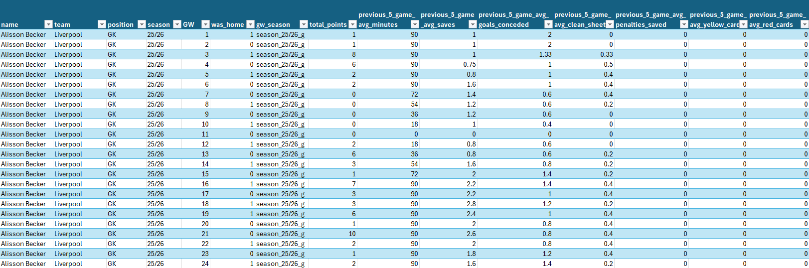
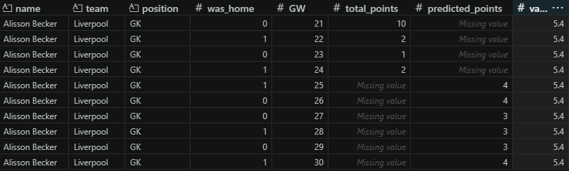

# Forecasting Fantasy Premier League Player Points Using Multiple Linear Regression

## Executive Summary
Fantasy Premier League (FPL) is a game in which users select a squad of Premier League players who earn points based on real match performances. This project aims to help users maximise points by enabling informed decision making through multiple regression models that predict player points using historical performance data. A combination of player, performance and fixture variables were used to estimate points in future gameweeks (GWs).

The dataset was created by combining historical data for current players with current season data, before being cleaned and split into training and testing sets. Model performance was evaluated using $R^2$, RMSE and MAE, the results suggest that linear regression can identify a moderate relationship between historical player performance and FPL points.

While the model performs well for regularly playing player, its accuracy may decrease overtime and for those with limited minutes or matches. Overall, the analysis predicts that Igor Thiago is predicted to achieve the highest number of points and Nordi Mukiele is forecasted to achieve the highest points per million.

## Project background

FPL is an online football game played by over 12.8 million users (Wikipedia, 2026) in which a user selects a squad of fifteen Premier League players (two goalkeepers, five defenders, five midfielders and three forwards) who earn points based on real match performances. Users have a budget of £100,000,000 to build their squad, with a maximum of three players allowed per club, users can transfer players between gameweeks (Fantasy Premier League, no date). Player prices are set before the season starts but change dynamically throughout the season depending on player demand (Editorial, 2026). Players earn points for actions such as minutes played, goals scored, goals assisted and keeping clean sheets however points can be deducted for conceding goals or receiving cards; points earned for actions vary per playing position (The Scout, 2025).  

## ETL Pipeline
<p align="center">
  
  <b>Figure 1: ETL Pipeline</b>
</p>

## Data preparation and Source
The data was sourced from a GitHub repository (Vaastav, 2026) that contained both current seasons
FPL data and historical data from the previous nine seasons. An advantage of using open data is that
it imporves the reproducibility of the analysis (The University of Manchester, 2025); reproducibility
is important in data science as it builds trust in the model (University of Cambridge, no date). Using
Python, the historical data was extracted, combined into a single DataFrame (Figure 2) and then merged
with the current season data (Figure 3) using an inner join on player name (Figure 4). This ensured that
only players currently active and available for FPL selection were included in the analysis. A disadvantage
of joining on player name is that it could cause ambiguity as names could change between seasons or
multiple players share the same name however player name was chosen because player ID changed each
season. Nonessential columns were removed to limit unnecessary complexity, ensuring that the dataset
is relevant and has an appropriate level of granularity improves the data quality of the dataset (Jones,
no date)

<p align="center">
  
  <b>Figure 2: Historical Dataset</b>
</p>

<p align="center">
  
  <b>Figure 3: Current Season Dataset</b>
</p>

<p align="center">
  
  <b>Figure 4: Combined Dataset</b>
</p>

## Exploratory Data Analysis
The datasets were inspected to ensure the data types were correct; this is important because incorrect datatypes can reduce model accuracy (Wicaksono, 2025). Using the formula below the sample sizes were evaluated to determine whether they were sufficient for analysis (Seabrook, 2025); Table 1 indicates that the samples sizes were sufficient to perform the analysis and reduce the risk of overfitting (Ghasemzadeh et al,2024).

Sample size formula: **N ≥ 10k**

Where:  
- **N** = Required sample size  
- **k** = number of independent variables  

| Position   | Sample Size| Required Sample Size| Conclusion                                                              |
|------------|------------|---------------------|----------------------------------------------------------------------------|
| Goalkeeper | 4311       | 110                 | Sample size ≥ required sample size, therefore it is sufficient             |
| Defender   | 18537      | 100                 | Sample size ≥ required sample size, therefore it is sufficient             |
| Midfielder | 21896      | 110                 | Sample size ≥ required sample size, therefore it is sufficient             |
| Forward    | 4790       | 90                  | Sample size ≥ required sample size, therefore it is sufficient             |

<p align="center"><b>Table 1: Sample sizes</b></p>
<p align="center">
</p>

The histograms (Figure 5) show that most players score between 0 and 3 points per gameweek however
the distribution spread increases from goalkeepers to forwards. Forwards display the greatest variability
and highest potential for extreme points; likely due to increased opportunity to perform high-earning
actions such as scoring goals.
<p align="center">
  
  <b>Figure 5: Histogram</b>
</p>

## Models Iteration 1 (i1)
### Models Variables
The variables in Tables 2-5 were used to create the models using the formulae below:

<details open>
<summary><b>Table 2: Goalkeeper Variables (click to expand)</b></summary>

<br>

| Variable | Variable name |
|----------|--------------|
| X<sub>gk1</sub>   | previous_5_game_avg_minutes |
| X<sub>gk2</sub>   | previous_5_game_avg_saves |
| X<sub>gk3</sub>   | previous_5_game_avg_total_points |
| X<sub>gk4</sub>   | previous_5_game_avg_influence |
| X<sub>gk5</sub>   | previous_5_game_avg_goals_conceded |
| X<sub>gk6</sub>   | previous_5_game_avg_clean_sheets |
| X<sub>gk7</sub>   | previous_5_game_avg_penalties_saved |
| X<sub>gk8</sub>   | previous_5_game_avg_yellow_cards |
| X<sub>gk9</sub>   | previous_5_game_avg_red_cards |
| X<sub>gk10</sub>  | value |
| X<sub>gk11</sub>  | was_home |

<p align="center"><b>Table 2: Goalkeeper Variables</b></p>

</details>

<br>

<p align="center">
Total Points<sub>gk</sub> = β<sub>0</sub> + β<sub>1</sub>X<sub>gk1</sub> + β<sub>2</sub>X<sub>gk2</sub> + β<sub>3</sub>X<sub>gk3</sub> + β<sub>4</sub>X<sub>gk4</sub> + β<sub>5</sub>X<sub>gk5</sub> + β<sub>6</sub>X<sub>gk6</sub> + β<sub>7</sub>X<sub>gk7</sub> + β<sub>8</sub>X<sub>gk8</sub> + β<sub>9</sub>X<sub>gk9</sub> + β<sub>10</sub>X<sub>gk10</sub> + β<sub>11</sub>X<sub>gk11</sub>
</p>


<details open>
<summary><b>Table 3: Defender Variables (click to expand)</b></summary>

<br>

| Variable | Variable name |
|----------|--------------|
| X<sub>def1</sub>   | previous_5_game_avg_minutes |
| X<sub>def2</sub>   | previous_5_game_avg_assists |
| X<sub>def3</sub>   | previous_5_game_avg_total_points |
| X<sub>def4</sub>   | previous_5_game_avg_influence |
| X<sub>def5</sub>   | previous_5_game_avg_goals_conceded |
| X<sub>def6</sub>   | previous_5_game_avg_clean_sheets |
| X<sub>def7</sub>   | previous_5_game_avg_yellow_cards |
| X<sub>def8</sub>   | previous_5_game_avg_red_cards |
| X<sub>def9</sub>   | value |
| X<sub>def10</sub>  | was_home |

<p align="center"><b>Table: Defender Variables</b></p>

</details>

<br>

<p align="center">
Total Points<sub>def</sub> = β<sub>0</sub> + β<sub>1</sub>X<sub>def1</sub> + β<sub>2</sub>X<sub>def2</sub> + β<sub>3</sub>X<sub>def3</sub> + β<sub>4</sub>X<sub>def4</sub> + β<sub>5</sub>X<sub>def5</sub> + β<sub>6</sub>X<sub>def6</sub> + β<sub>7</sub>X<sub>def7</sub> + β<sub>8</sub>X<sub>def8</sub> + β<sub>9</sub>X<sub>def9</sub> + β<sub>10</sub>X<sub>def10</sub>
</p>

<details open>
<summary><b>Table 4: Midfielder Variables (click to expand)</b></summary>

<br>

| Variable | Variable name |
|----------|--------------|
| X<sub>mid1</sub>   | previous_5_game_avg_minutes |
| X<sub>mid2</sub>   | previous_5_game_avg_goals_conceded |
| X<sub>mid3</sub>   | previous_5_game_avg_clean_sheets |
| X<sub>mid4</sub>   | previous_5_game_avg_yellow_cards |
| X<sub>mid5</sub>   | previous_5_game_avg_red_cards |
| X<sub>mid6</sub>   | previous_5_game_avg_assists |
| X<sub>mid7</sub>   | previous_5_game_avg_goals_scored |
| X<sub>mid8</sub>   | previous_5_game_avg_influence |
| X<sub>mid9</sub>   | previous_5_game_avg_total_points |
| X<sub>mid10</sub>  | value |
| X<sub>mid11</sub>  | was_home |

<p align="center"><b>Table: Midfielder Variables</b></p>

</details>

<br>

<p align="center">
Total Points<sub>mid</sub> = β<sub>0</sub> + β<sub>1</sub>X<sub>mid1</sub> + β<sub>2</sub>X<sub>mid2</sub> + β<sub>3</sub>X<sub>mid3</sub> + β<sub>4</sub>X<sub>mid4</sub> + β<sub>5</sub>X<sub>mid5</sub> + β<sub>6</sub>X<sub>mid6</sub> + β<sub>7</sub>X<sub>mid7</sub> + β<sub>8</sub>X<sub>mid8</sub> + β<sub>9</sub>X<sub>mid9</sub> + β<sub>10</sub>X<sub>mid10</sub> + β<sub>11</sub>X<sub>mid11</sub>
</p>

<details open>
<summary><b>Table 5: Forward Variables (click to expand)</b></summary>

<br>

| Variable | Variable name |
|----------|--------------|
| X<sub>fwd1</sub>   | previous_5_game_avg_minutes |
| X<sub>fwd2</sub>   | previous_5_game_avg_influence |
| X<sub>fwd3</sub>   | previous_5_game_avg_yellow_cards |
| X<sub>fwd4</sub>   | previous_5_game_avg_red_cards |
| X<sub>fwd5</sub>   | previous_5_game_avg_assists |
| X<sub>fwd6</sub>   | previous_5_game_avg_goals_scored |
| X<sub>fwd7</sub>   | previous_5_game_avg_total_points |
| X<sub>fwd8</sub>   | value |
| X<sub>fwd9</sub>   | was_home |

<p align="center"><b>Table 5: Forward Variables</b></p>

</details>

<br>

<p align="center">
Total Points<sub>fwd</sub> = β<sub>0</sub> + β<sub>1</sub>X<sub>fwd1</sub> + β<sub>2</sub>X<sub>fwd2</sub> + β<sub>3</sub>X<sub>fwd3</sub> + β<sub>4</sub>X<sub>fwd4</sub> + β<sub>5</sub>X<sub>fwd5</sub> + β<sub>6</sub>X<sub>fwd6</sub> + β<sub>7</sub>X<sub>fwd7</sub> + β<sub>8</sub>X<sub>fwd8</sub> + β<sub>9</sub>X<sub>fwd9</sub>
</p>

### Hypotheses
For each variable a null hypothesis was created stating that the variable doesn’t influence total points
and an alternative hypothesis stating that it does influence total points.

<details open>
<summary><b>Table: Goalkeeper Model i1 Hypotheses (click to expand)</b></summary>

<br>

| Hypothesis | Variable | Null Hypothesis (H₀) | Alternative Hypothesis (H₁) |
|-----------|----------|----------------------|-----------------------------|
| H<sub>gk1</sub>  | previous_5_game_avg_minutes | Doesn't influence total points | Does influence total points |
| H<sub>gk2</sub>  | previous_5_game_avg_saves | Doesn't influence total points | Does influence total points |
| H<sub>gk3</sub>  | previous_5_game_avg_total_points | Doesn't influence total points | Does influence total points |
| H<sub>gk4</sub>  | previous_5_game_avg_influence | Doesn't influence total points | Does influence total points |
| H<sub>gk5</sub>  | previous_5_game_avg_goals_conceded | Doesn't influence total points | Does influence total points |
| H<sub>gk6</sub>  | previous_5_game_avg_clean_sheets | Doesn't influence total points | Does influence total points |
| H<sub>gk7</sub>  | previous_5_game_avg_penalties_saved | Doesn't influence total points | Does influence total points |
| H<sub>gk8</sub>  | previous_5_game_avg_yellow_cards | Doesn't influence total points | Does influence total points |
| H<sub>gk9</sub>  | previous_5_game_avg_red_cards | Doesn't influence total points | Does influence total points |
| H<sub>gk10</sub> | value | Doesn't influence total points | Does influence total points |
| H<sub>gk11</sub> | was_home | Doesn't influence total points | Does influence total points |

<p align="center"><b>Table: Goalkeeper Model i1 Hypotheses</b></p>

</details>

<details open>
<summary><b>Table: Defender Model i1 Hypotheses (click to expand)</b></summary>

<br>

| Hypothesis | Variable | Null Hypothesis (H₀) | Alternative Hypothesis (H₁) |
|-----------|----------|----------------------|-----------------------------|
| H<sub>def1</sub>  | previous_5_game_avg_minutes | Doesn't influence total points | Does influence total points |
| H<sub>def2</sub>  | previous_5_game_avg_assists | Doesn't influence total points | Does influence total points |
| H<sub>def3</sub>  | previous_5_game_avg_total_points | Doesn't influence total points | Does influence total points |
| H<sub>def4</sub>  | previous_5_game_avg_influence | Doesn't influence total points | Does influence total points |
| H<sub>def5</sub>  | previous_5_game_avg_goals_conceded | Doesn't influence total points | Does influence total points |
| H<sub>def6</sub>  | previous_5_game_avg_clean_sheets | Doesn't influence total points | Does influence total points |
| H<sub>def7</sub>  | previous_5_game_avg_yellow_cards | Doesn't influence total points | Does influence total points |
| H<sub>def8</sub>  | previous_5_game_avg_red_cards | Doesn't influence total points | Does influence total points |
| H<sub>def9</sub>  | value | Doesn't influence total points | Does influence total points |
| H<sub>def10</sub> | was_home | Doesn't influence total points | Does influence total points |

<p align="center"><b>Table: Defender Model i1 Hypotheses</b></p>

</details>

<details open>
<summary><b>Table: Midfielder Model i1 Hypotheses (click to expand)</b></summary>

<br>

| Hypothesis | Variable | Null Hypothesis (H₀) | Alternative Hypothesis (H₁) |
|-----------|----------|----------------------|-----------------------------|
| H<sub>mid1</sub>  | previous_5_game_avg_minutes | Doesn't influence total points | Does influence total points |
| H<sub>mid2</sub>  | previous_5_game_avg_goals_conceded | Doesn't influence total points | Does influence total points |
| H<sub>mid3</sub>  | previous_5_game_avg_clean_sheets | Doesn't influence total points | Does influence total points |
| H<sub>mid4</sub>  | previous_5_game_avg_yellow_cards | Doesn't influence total points | Does influence total points |
| H<sub>mid5</sub>  | previous_5_game_avg_red_cards | Doesn't influence total points | Does influence total points |
| H<sub>mid6</sub>  | previous_5_game_avg_assists | Doesn't influence total points | Does influence total points |
| H<sub>mid7</sub>  | previous_5_game_avg_goals_scored | Doesn't influence total points | Does influence total points |
| H<sub>mid8</sub>  | previous_5_game_avg_influence | Doesn't influence total points | Does influence total points |
| H<sub>mid9</sub>  | previous_5_game_avg_total_points | Doesn't influence total points | Does influence total points |
| H<sub>mid10</sub> | value | Doesn't influence total points | Does influence total points |
| H<sub>mid11</sub> | was_home | Doesn't influence total points | Does influence total points |

<p align="center"><b>Table: Midfielder Model i1 Hypotheses</b></p>

</details>

<details open>
<summary><b>Table: Forward Model i1 Hypotheses (click to expand)</b></summary>

<br>

| Hypothesis | Variable | Null Hypothesis (H₀) | Alternative Hypothesis (H₁) |
|-----------|----------|----------------------|-----------------------------|
| H<sub>fwd1</sub>  | previous_5_game_avg_minutes | Doesn't influence total points | Does influence total points |
| H<sub>fwd2</sub>  | previous_5_game_avg_influence | Doesn't influence total points | Does influence total points |
| H<sub>fwd3</sub>  | previous_5_game_avg_yellow_cards | Doesn't influence total points | Does influence total points |
| H<sub>fwd4</sub>  | previous_5_game_avg_red_cards | Doesn't influence total points | Does influence total points |
| H<sub>fwd5</sub>  | previous_5_game_avg_assists | Doesn't influence total points | Does influence total points |
| H<sub>fwd6</sub>  | previous_5_game_avg_goals_scored | Doesn't influence total points | Does influence total points |
| H<sub>fwd7</sub>  | previous_5_game_avg_total_points | Doesn't influence total points | Does influence total points |
| H<sub>fwd8</sub>  | value | Doesn't influence total points | Does influence total points |
| H<sub>fwd9</sub>  | was_home | Doesn't influence total points | Does influence total points |

<p align="center"><b>Table: Forward Model i1 Hypotheses</b></p>

</details>


### Train/Test Split
The data was divided into an 70% training 30% testing split (Figure 6) to ensure the models were trained
on a substantial portion of the data while reserving enough for evaluation; this allowed for an unbiased
assessment of its predictive performance. To make the analysis reproducible a random state was set to
ensure that the training-test split was consistent each time the model was run, an advantage of this is
that it allows the results across experiments to be comparable (Rukshan, 2022).

<details open>
<summary><b>Figure 6: Train/Test Split (click to expand)</b></summary>
<p align="center">
  
  <b>Figure 6: Train/Test Split</b>
</p>
</details>

### Models Creation

A multiple linear regression model was trained for each position using the features shown in tables 2-5
to predict total points earned. The models were fitted on training data (Figure 7) and evaluated using
test data (Figure 8).

<details open>
<summary><b>Figure 7: Models Creation (click to expand)</b></summary>
<p align="center">
  
  <b>Figure 7: Models Creation </b>
</p>
</details>

<details open>
<summary><b>Figure 8: Models Testing (click to expand)</b></summary>
<p align="center">
  
  <b>Figure 7: Models Testing </b>
</p>
</details>

### Models Evaluation
#### **Correlation Plots**

The models were assessed for multicollinearity by using the correlation plots and tables
6-9 . The results indicate that previous_5_game_avg_total_points exhibits high correlation (>0.8) with
multiple other performance features (minutes, influence, etc). This suggests that removing this variable
may improve model stability and reduce multicollinearity (Singh, 2024).

<details open>
<summary><b>Figure: Iteration 1 correlation plot - GK (click to expand)</b></summary>
<p align="center">
  
  <b>Figure: Iteration 1 correlation plot - GK</b>
</p>
</details>

<details open>
<summary><b>Figure: Iteration 1 correlation plot - DEF (click to expand)</b></summary>
<p align="center">
  
  <b>Figure: Iteration 1 correlation plot - DEF</b>
</p>
</details>

<details open>
<summary><b>Figure: Iteration 1 correlation plot - MID (click to expand)</b></summary>
<p align="center">
  
  <b>Figure: Iteration 1 correlation plot - MID</b>
</p>
</details>

<details open>
<summary><b>Figure: Iteration 1 correlation plot - FWD (click to expand)</b></summary>
<p align="center">
  
  <b>Figure: Iteration 1 correlation plot - FWD</b>
</p>
</details>

<br>

<details open>
<summary><b>Table 6: Goalkeeper Model i1 Coefficients (click to expand)</b></summary>

<br>

| Variable | Coefficient |
|----------|-------------|
| previous_5_game_avg_minutes | -0.009 |
| previous_5_game_avg_saves | -0.151 |
| previous_5_game_avg_total_points | 1.456 |
| previous_5_game_avg_influence | -0.010 |
| previous_5_game_avg_goals_conceded | 0.121 |
| previous_5_game_avg_clean_sheets | -1.795 |
| previous_5_game_avg_penalties_saved | -1.430 |
| previous_5_game_avg_yellow_cards | 0.328 |
| previous_5_game_avg_red_cards | -2.806 |
| value | -0.039 |
| was_home | 0.145 |

<p align="center"><b>Table 6: Goalkeeper Model i1 Coefficients</b></p>

</details>


<details open>
<summary><b>Table 7: Defender Model i1 Coefficients (click to expand)</b></summary>

<br>

| Variable | Coefficient |
|----------|-------------|
| previous_5_game_avg_minutes | 0.000 |
| previous_5_game_avg_assists | 0.176 |
| previous_5_game_avg_total_points | 0.954 |
| previous_5_game_avg_influence | 0.000 |
| previous_5_game_avg_goals_conceded | -0.036 |
| previous_5_game_avg_clean_sheets | 0.091 |
| previous_5_game_avg_yellow_cards | -0.433 |
| previous_5_game_avg_red_cards | -1.922 |
| value | -0.079 |
| was_home | 0.144 |

<p align="center"><b>Table 7: Defender Model i1 Coefficients</b></p>

</details>


<details open>
<summary><b>Table 8: Midfielder Model i1 Coefficients (click to expand)</b></summary>

<br>

| Variable | Coefficient |
|----------|-------------|
| previous_5_game_avg_minutes | -0.009 |
| previous_5_game_avg_goals_conceded | -0.050 |
| previous_5_game_avg_clean_sheets | -0.094 |
| previous_5_game_avg_yellow_cards | 0.314 |
| previous_5_game_avg_red_cards | -0.444 |
| previous_5_game_avg_assists | -0.632 |
| previous_5_game_avg_goals_scored | -1.395 |
| previous_5_game_avg_influence | 0.011 |
| previous_5_game_avg_total_points | 1.193 |
| value | -0.003 |
| was_home | 0.162 |

<p align="center"><b>Table 8: Midfielder Model i1 Coefficients</b></p>

</details>


<details open>
<summary><b>Table 9: Forward Model i1 Coefficients (click to expand)</b></summary>

<br>

| Variable | Coefficient |
|----------|-------------|
| previous_5_game_avg_minutes | -0.013 |
| previous_5_game_avg_influence | -0.030 |
| previous_5_game_avg_yellow_cards | 1.175 |
| previous_5_game_avg_red_cards | -2.232 |
| previous_5_game_avg_assists | -0.468 |
| previous_5_game_avg_goals_scored | 0.002 |
| previous_5_game_avg_total_points | 1.325 |
| value | -0.054 |
| was_home | 0.212 |

<p align="center"><b>Table 9: Forward Model i1 Coefficients</b></p>

</details>

#### **Hypothesis Testing**
A 5% significance level was used to test the hypotheses. At this threshold results with a p-value < 0.05
are considered statistically significant (Shreffler and Huecker, 2023)

<details open>
<summary><b>Table 10: i1 Goalkeeper Hypothesis Test Results (click to expand)</b></summary>

<br>

| Hypothesis | Variable | P-value | Outcome |
|------------|----------|---------|---------|
| H<sub>gk1</sub> | previous_5_game_avg_minutes | 0.045 | Reject Null Hypothesis<br>(P-value < 0.05) |
| H<sub>gk2</sub> | previous_5_game_avg_saves | 0.269 | <b>Fail to reject Null Hypothesis</b><br>(P-value > 0.05) |
| H<sub>gk3</sub> | previous_5_game_avg_total_points | 0.000 | Reject Null Hypothesis<br>(P-value < 0.05) |
| H<sub>gk4</sub> | previous_5_game_avg_influence | 0.597 | <b>Fail to reject Null Hypothesis</b><br>(P-value > 0.05) |
| H<sub>gk5</sub> | previous_5_game_avg_goals_conceded | 0.387 | <b>Fail to reject Null Hypothesis</b><br>(P-value > 0.05) |
| H<sub>gk6</sub> | previous_5_game_avg_clean_sheets | 0.010 | Reject Null Hypothesis<br>(P-value < 0.05) |
| H<sub>gk7</sub> | previous_5_game_avg_penalties_saved | 0.205 | <b>Fail to reject Null Hypothesis</b><br>(P-value > 0.05) |
| H<sub>gk8</sub> | previous_5_game_avg_yellow_cards | 0.443 | <b>Fail to reject Null Hypothesis</b><br>(P-value > 0.05) |
| H<sub>gk9</sub> | previous_5_game_avg_red_cards | 0.307 | <b>Fail to reject Null Hypothesis</b><br>(P-value > 0.05) |
| H<sub>gk10</sub> | value | 0.667 | <b>Fail to reject Null Hypothesis</b><br>(P-value > 0.05) |
| H<sub>gk11</sub> | was_home | 0.041 | Reject Null Hypothesis<br>(P-value < 0.05) |

<p align="center"><b>Table 10: i1 Goalkeeper Hypothesis Test Results</b></p>

</details>


<details open>
<summary><b>Table 11: i1 Defender Hypothesis Test Results (click to expand)</b></summary>

<br>

| Hypothesis | Variable | P-value | Outcome |
|------------|----------|---------|---------|
| H<sub>def1</sub> | previous_5_game_avg_minutes | 0.824 | <b>Fail to reject Null Hypothesis</b><br>(P-value > 0.05) |
| H<sub>def2</sub> | previous_5_game_avg_assists | 0.455 | <b>Fail to reject Null Hypothesis</b><br>(P-value > 0.05) |
| H<sub>def3</sub> | previous_5_game_avg_total_points | 0.000 | Reject Null Hypothesis<br>(P-value < 0.05) |
| H<sub>def4</sub> | previous_5_game_avg_influence | 0.950 | <b>Fail to reject Null Hypothesis</b><br>(P-value > 0.05) |
| H<sub>def5</sub> | previous_5_game_avg_goals_conceded | 0.594 | <b>Fail to reject Null Hypothesis</b><br>(P-value > 0.05) |
| H<sub>def6</sub> | previous_5_game_avg_clean_sheets | 0.717 | <b>Fail to reject Null Hypothesis</b><br>(P-value > 0.05) |
| H<sub>def7</sub> | previous_5_game_avg_yellow_cards | 0.005 | Reject Null Hypothesis<br>(P-value < 0.05) |
| H<sub>def8</sub> | previous_5_game_avg_red_cards | 0.008 | Reject Null Hypothesis<br>(P-value < 0.05) |
| H<sub>def9</sub> | value | 0.027 | Reject Null Hypothesis<br>(P-value < 0.05) |
| H<sub>def10</sub> | was_home | 0.000 | Reject Null Hypothesis<br>(P-value < 0.05) |

<p align="center"><b>Table 11: i1 Defender Hypothesis Test Results</b></p>

</details>


<details open>
<summary><b>Table 12: i1 Midfielder Hypothesis Test Results (click to expand)</b></summary>

<br>

| Hypothesis | Variable | P-value | Outcome |
|------------|----------|---------|---------|
| H<sub>mid1</sub> | previous_5_game_avg_minutes | 0.000 | Reject Null Hypothesis<br>(P-value < 0.05) |
| H<sub>mid2</sub> | previous_5_game_avg_goals_conceded | 0.398 | <b>Fail to reject Null Hypothesis</b><br>(P-value > 0.05) |
| H<sub>mid3</sub> | previous_5_game_avg_clean_sheets | 0.586 | <b>Fail to reject Null Hypothesis</b><br>(P-value > 0.05) |
| H<sub>mid4</sub> | previous_5_game_avg_yellow_cards | 0.042 | Reject Null Hypothesis<br>(P-value < 0.05) |
| H<sub>mid5</sub> | previous_5_game_avg_red_cards | 0.592 | <b>Fail to reject Null Hypothesis</b><br>(P-value > 0.05) |
| H<sub>mid6</sub> | previous_5_game_avg_assists | 0.011 | Reject Null Hypothesis<br>(P-value < 0.05) |
| H<sub>mid7</sub> | previous_5_game_avg_goals_scored | 0.001 | Reject Null Hypothesis<br>(P-value < 0.05) |
| H<sub>mid8</sub> | previous_5_game_avg_influence | 0.069 | <b>Fail to reject Null Hypothesis</b><br>(P-value > 0.05) |
| H<sub>mid9</sub> | previous_5_game_avg_total_points | 0.000 | Reject Null Hypothesis<br>(P-value < 0.05) |
| H<sub>mid10</sub> | value | 0.832 | <b>Fail to reject Null Hypothesis</b><br>(P-value > 0.05) |
| H<sub>mid11</sub> | was_home | 0.000 | Reject Null Hypothesis<br>(P-value < 0.05) |

<p align="center"><b>Table 12: i1 Midfielder Hypothesis Test Results</b></p>

</details>


<details open>
<summary><b>Table 13: i1 Forward Hypothesis Test Results (click to expand)</b></summary>

<br>

| Hypothesis | Variable | P-value | Outcome |
|------------|----------|---------|---------|
| H<sub>fw1</sub> | previous_5_game_avg_minutes | 0.001 | Reject Null Hypothesis<br>(P-value < 0.05) |
| H<sub>fw2</sub> | previous_5_game_avg_influence | 0.112 | <b>Fail to reject Null Hypothesis</b><br>(P-value > 0.05) |
| H<sub>fw3</sub> | previous_5_game_avg_yellow_cards | 0.004 | Reject Null Hypothesis<br>(P-value < 0.05) |
| H<sub>fw4</sub> | previous_5_game_avg_red_cards | 0.445 | <b>Fail to reject Null Hypothesis</b><br>(P-value > 0.05) |
| H<sub>fw5</sub> | previous_5_game_avg_assists | 0.461 | <b>Fail to reject Null Hypothesis</b><br>(P-value > 0.05) |
| H<sub>fw6</sub> | previous_5_game_avg_goals_scored | 0.998 | <b>Fail to reject Null Hypothesis</b><br>(P-value > 0.05) |
| H<sub>fw7</sub> | previous_5_game_avg_total_points | 0.000 | Reject Null Hypothesis<br>(P-value < 0.05) |
| H<sub>fw8</sub> | value | 0.061 | <b>Fail to reject Null Hypothesis</b><br>(P-value > 0.05) |
| H<sub>fw9</sub> | was_home | 0.018 | Reject Null Hypothesis<br>(P-value < 0.05) |

<p align="center"><b>Table 13: i1 Forward Hypothesis Test Results</b></p>

</details>


#### **Model Accuracy**

The code shown in Python 1 demonstrates how accuracy metrics such as R2 score, MAE and RMSE
were created to evaluate the performance of iteration 1.
The R2 values ranged from 0.36 to 0.47, indicating that the models explain about 36% - 47% of the
variation in total points, this suggests there is a substantial amount of unexplained variability likely
due to the randomness of football matches. The MAE and RMSE show that goalkeepers are the most
predictable whereas forwards are the hardest to predict (Table 14)


<details open>
<summary><b>Table 14: i1 Performance by Position (click to expand)</b></summary>

<br>

| Position | R² Score | Intercept | MAE | RMSE |
|----------|----------|-----------|-----|------|
| GK  | 0.465 | 0.191 | 1.170 | 1.864 |
| DEF | 0.387 | 0.374 | 1.356 | 2.165 |
| MID | 0.407 | 0.018 | 1.369 | 2.247 |
| FWD | 0.362 | 0.272 | 1.655 | 2.482 |

<p align="center"><b>Table 14: i1 Performance by Position</b></p>

</details>


<details open>
<summary><b>Python 1: Model Metrics and Evaluation (click to expand)</b></summary>


```python
def model_metrics(y_test, y_pred):
    r2_score = round(met.r2_score(y_test, y_pred), 3)
    mae = round(met.mean_absolute_error(y_test, y_pred), 3)
    rmse = float(format(np.sqrt(met.mean_squared_error(y_test, y_pred)), '.3f'))
    return r2_score, mae, rmse


gk_r2_score, gk_mae, gk_rmse = model_metrics(y_test_gk, y_pred_gk)
def_r2_score, def_mae, def_rmse = model_metrics(y_test_def, y_pred_def)
mid_r2_score, mid_mae, mid_rmse = model_metrics(y_test_mid, y_pred_mid)
fwd_r2_score, fwd_mae, fwd_rmse = model_metrics(y_test_fwd, y_pred_fwd)


# Results table
model_results = pd.DataFrame({
    'Position Model': ['GK', 'DEF', 'MID', 'FWD'],
    'R2 Score': [gk_r2_score, def_r2_score, mid_r2_score, fwd_r2_score],
    'Intercept': [
        round(gk_model.intercept_, 3),
        round(def_model.intercept_, 3),
        round(mid_model.intercept_, 3),
        round(fwd_model.intercept_, 3)
    ],
    'MAE': [gk_mae, def_mae, mid_mae, fwd_mae],
    'RMSE': [gk_rmse, def_rmse, mid_rmse, fwd_rmse],
})

model_results
```

<p align="center"><b>Python 1: Model Metrics and Evaluation</b></p>
</details>

#### **i1 Conclusion**
The feature previous_5 game_avg_total_points has high multicollinearity with other performance fea-
tures (minutes, influence, cleans sheets, etc) the correlation levels indicate there is a substantial over-
lap between these features. Additionally, figures 24-31 show it has a high t-value (between 8.723 and
23.182) across all models which inflates its statistical dominance whilst suppressing the importance
of other features; this is due to it being derived from the target variable (total˙points). Therefore
previous_5 game_avg_total_points was removed from future iterations to improve stability and inter-
pretability, however other statistically insignificant features such as previous_5 game_avg_saves were
kept as multicollinearity affects coefficient reliability rather than overall regression validity (Ellsworth et
al, 2023).


## Models Iteration 2 (i2)
After the feature total points was removed the methodology applied in i1 was repeated.

### Models Evaluation

#### **Correlation Plot**

The correlation plots suggest that all four models include features with high correlation however these were kept
as they represent key in game event that contribute significantly to points earned.


<details open>
<summary><b>Figure: Iteration 2 correlation plot - GK (click to expand)</b></summary>
<p align="center">
  
  <b>Figure: Iteration 2 correlation plot - GK</b>
</p>
</details>

<details open>
<summary><b>Figure: Iteration 2 correlation plot - DEF (click to expand)</b></summary>
<p align="center">
  
  <b>Figure: Iteration 2 correlation plot - DEF</b>
</p>
</details>

<details open>
<summary><b>Figure: Iteration 2 correlation plot - MID (click to expand)</b></summary>
<p align="center">
  
  <b>Figure: Iteration 2 correlation plot - MID</b>
</p>
</details>

<details open>
<summary><b>Figure: Iteration 2 correlation plot - FWD (click to expand)</b></summary>
<p align="center">
  
  <b>Figure: Iteration 2 correlation plot - FWD</b>
</p>
</details>

#### **Hypothesis Testing**
<details open>
<summary><b>Table 15: Goalkeeper Model i2 Hypothesis Test Results (click to expand)</b></summary>

<br>

| Hypothesis | Variable | P-value | Outcome |
|-----------|----------|--------|----------|
| H<sub>gk1</sub> | previous<sub>5</sub>_game_avg_minutes | 0.000 | Reject H<sub>0</sub> (p < 0.05) |
| H<sub>gk2</sub> | previous<sub>5</sub>_game_avg_saves | 0.005 | Reject H<sub>0</sub> (p < 0.05) |
| H<sub>gk3</sub> | previous<sub>5</sub>_game_avg_influence | 0.373 | Fail to reject H<sub>0</sub> (p > 0.05) |
| H<sub>gk4</sub> | previous<sub>5</sub>_game_avg_goals_conceded | 0.000 | Reject H<sub>0</sub> (p < 0.05) |
| H<sub>gk5</sub> | previous<sub>5</sub>_game_avg_clean_sheets | 0.000 | Reject H<sub>0</sub> (p < 0.05) |
| H<sub>gk6</sub> | previous<sub>5</sub>_game_avg_penalties_saved | 0.000 | Reject H<sub>0</sub> (p < 0.05) |
| H<sub>gk7</sub> | previous<sub>5</sub>_game_avg_yellow_cards | 0.023 | Reject H<sub>0</sub> (p < 0.05) |
| H<sub>gk8</sub> | previous<sub>5</sub>_game_avg_red_cards | 0.018 | Reject H<sub>0</sub> (p < 0.05) |
| H<sub>gk9</sub> | value | 0.513 | Fail to reject H<sub>0</sub> (p > 0.05) |
| H<sub>gk10</sub> | was_home | 0.053 | Fail to reject H<sub>0</sub> (p > 0.05) |

<p align="center"><b>Table 15: i2 Goalkeeper Hypothesis Test Results</b></p>
</details>

<details open>
<summary><b>Table 16: Defender Model i2 Hypothesis Test Results (click to expand)</b></summary>

<br>

| Hypothesis | Variable | P-value | Outcome |
|-----------|----------|--------|----------|
| H<sub>def1</sub> | previous<sub>5</sub>_game_avg_minutes | 0.000 | Reject H<sub>0</sub> (p < 0.05) |
| H<sub>def2</sub> | previous<sub>5</sub>_game_avg_assists | 0.000 | Reject H<sub>0</sub> (p < 0.05) |
| H<sub>def3</sub> | previous<sub>5</sub>_game_avg_influence | 0.000 | Reject H<sub>0</sub> (p < 0.05) |
| H<sub>def4</sub> | previous<sub>5</sub>_game_avg_goals_conceded | 0.000 | Reject H<sub>0</sub> (p < 0.05) |
| H<sub>def5</sub> | previous<sub>5</sub>_game_avg_clean_sheets | 0.000 | Reject H<sub>0</sub> (p < 0.05) |
| H<sub>def6</sub> | previous<sub>5</sub>_game_avg_yellow_cards | 0.000 | Reject H<sub>0</sub> (p < 0.05) |
| H<sub>def7</sub> | previous<sub>5</sub>_game_avg_red_cards | 0.000 | Reject H<sub>0</sub> (p < 0.05) |
| H<sub>def8</sub> | value | 0.227 | Fail to reject H<sub>0</sub> (p > 0.05) |
| H<sub>def9</sub> | was_home | 0.000 | Reject H<sub>0</sub> (p < 0.05) |

<p align="center"><b>Table 16: i2 Defender Hypothesis Test Results</b></p>
</details>


<details open>
<summary><b>Table 17: Midfielder Model i2 Hypothesis Test Results (click to expand)</b></summary>

<br>

| Hypothesis | Variable | P-value | Outcome |
|-----------|----------|--------|----------|
| H<sub>mid1</sub> | previous<sub>5</sub>_game_avg_minutes | 0.000 | Reject H<sub>0</sub> (p < 0.05) |
| H<sub>mid2</sub> | previous<sub>5</sub>_game_avg_goals_conceded | 0.258 | Fail to reject H<sub>0</sub> (p > 0.05) |
| H<sub>mid3</sub> | previous<sub>5</sub>_game_avg_clean_sheets | 0.000 | Reject H<sub>0</sub> (p < 0.05) |
| H<sub>mid4</sub> | previous<sub>5</sub>_game_avg_yellow_cards | 0.000 | Reject H<sub>0</sub> (p < 0.05) |
| H<sub>mid5</sub> | previous<sub>5</sub>_game_avg_red_cards | 0.000 | Reject H<sub>0</sub> (p < 0.05) |
| H<sub>mid6</sub> | previous<sub>5</sub>_game_avg_assists | 0.000 | Reject H<sub>0</sub> (p < 0.05) |
| H<sub>mid7</sub> | previous<sub>5</sub>_game_avg_goals_scored | 0.000 | Reject H<sub>0</sub> (p < 0.05) |
| H<sub>mid8</sub> | previous<sub>5</sub>_game_avg_influence | 0.000 | Reject H<sub>0</sub> (p < 0.05) |
| H<sub>mid9</sub> | value | 0.168 | Fail to reject H<sub>0</sub> (p > 0.05) |
| H<sub>mid10</sub> | was_home | 0.000 | Reject H<sub>0</sub> (p < 0.05) |

<p align="center"><b>Table 17: i2 Midfielder Hypothesis Test Results</b></p>
</details>

<details open>
<summary><b>Table 18: Forward Model i2 Hypothesis Test Results (click to expand)</b></summary>

<br>

| Hypothesis | Variable | P-value | Outcome |
|-----------|----------|--------|----------|
| H<sub>fwd1</sub> | previous<sub>5</sub>_game_avg_minutes | 0.000 | Reject H<sub>0</sub> (p < 0.05) |
| H<sub>fwd2</sub> | previous<sub>5</sub>_game_avg_influence | 0.482 | Fail to reject H<sub>0</sub> (p > 0.05) |
| H<sub>fwd3</sub> | previous<sub>5</sub>_game_avg_yellow_cards | 0.557 | Fail to reject H<sub>0</sub> (p > 0.05) |
| H<sub>fwd4</sub> | previous<sub>5</sub>_game_avg_red_cards | 0.019 | Reject H<sub>0</sub> (p < 0.05) |
| H<sub>fwd5</sub> | previous<sub>5</sub>_game_avg_assists | 0.000 | Reject H<sub>0</sub> (p < 0.05) |
| H<sub>fwd6</sub> | previous<sub>5</sub>_game_avg_goals_scored | 0.000 | Reject H<sub>0</sub> (p < 0.05) |
| H<sub>fwd7</sub> | value | 0.001 | Reject H<sub>0</sub> (p < 0.05) |
| H<sub>fwd8</sub> | was_home | 0.019 | Reject H<sub>0</sub> (p < 0.05) |

<p align="center"><b>Table 18: i2 Forward Hypothesis Test Results</b></p>
</details>

#### **Model Accuracy**
The model performance table below suggests that the model’s accuracy has worsened compared to i1

<details open>
<summary><b>Table 19: i2 Model Performance by Position (click to expand)</b></summary>

<br>

| Position | R² Score | Intercept | MAE  | RMSE |
|----------|----------|-----------|------|------|
| GK       | 0.473    | 0.284     | 1.145 | 1.851 |
| DEF      | 0.358    | 0.310     | 1.398 | 2.216 |
| MID      | 0.395    | 0.304     | 1.414 | 2.269 |
| FWD      | 0.350    | 0.809     | 1.698 | 2.506 |


<p align="center"><b>Table 19: i2 Model Performance by Position</b></p>
</details>

#### **i2 Conclusion**
To improve model accuracy a third iteration was created in which all the non-significant variables except
from was_home were removed. Although the p-values for was_home were > 0.05 it was not removed from
the analysis because it is consistently hovering around significance; home advantage is a known football
effect and it may still improve the models predictive performance even if it is statistically weak.

## Models Iteration 3 (i3)
After the non-significant features were removed the methodology applied in i2 was repeated.

<details open>
<summary><b>Python 2: i3 Feature drop (click to expand)</b></summary>

```python
def variable_removal(df, total_feature, features):
    for variable in features:
        total_feature.remove(variable)
        df.drop(variable,axis='columns', inplace= True)


variable_removal(df_gk, gk_total_features, ['previous_5_game_avg_influence','value'])
variable_removal(df_def,def_total_features, ['value'])
variable_removal(df_mid,mid_total_features, ['previous_5_game_avg_goals_conceded','value'])
variable_removal(df_fwd,fwd_total_features, ['previous_5_game_avg_influence','previous_5_game_avg_yellow_cards'])
```

<p align="center"><b>Python 2: i3 Feature drop</b></p>
</details>


The correlation plots can be seen below and the accuracy results in table 20.

<details open>
<summary><b>Figure: Iteration 3 correlation plot - GK (click to expand)</b></summary>
<p align="center">
  
  <b>Figure: Iteration 3 correlation plot - GK</b>
</p>
</details>

<details open>
<summary><b>Figure: Iteration 3 correlation plot - DEF (click to expand)</b></summary>
<p align="center">
  
  <b>Figure: Iteration 3 correlation plot - DEF</b>
</p>
</details>

<details open>
<summary><b>Figure: Iteration 3 correlation plot - MID (click to expand)</b></summary>
<p align="center">
  
  <b>Figure: Iteration 3 correlation plot - MID</b>
</p>
</details>

<details open>
<summary><b>Figure: Iteration 3 correlation plot - FWD (click to expand)</b></summary>
<p align="center">
  
  <b>Figure: Iteration 3 correlation plot - FWD</b>
</p>
</details>


<details open>
<summary><b>Table 20: i3 Model performance by position(click to expand)</b></summary>

| Position | R² Score | Intercept | MAE  | RMSE |
|----------|----------|-----------|------|------|
| GK       | 0.473    | 0.027     | 1.145 | 1.850 |
| DEF      | 0.358    | 0.115     | 1.398 | 2.216 |
| MID      | 0.395    | 0.193     | 1.414 | 2.270 |
| FWD      | 0.350    | 0.801     | 1.698 | 2.506 |

<p align="center"><b>Table 20: i3 Model performance by position</b></p>
</details>


## Iteration Conclusion
Although some features in i1 have p-values > 0.05, Table 21 indicate that i1 provides better forecasting
than i2 and i3 in three of the four positional models. Higher R2 values indicate that i1 explains a greater
proportion of the variability in total score, whereas lower MAE and RMSE values indicate smaller
average prediction errors. Therefore although a p-value-based backward elimination approach (i3) was
evaluated, it did not improve predictive performance compared to the full model (i1). This suggests that
statistical significance alone is not a reliable criterion for feature selection in predictive football models
where predictive accuracy is more important than explanatory inference (Lo et al, 2015).

The coefficients in tables 6-9 indicate that red cards have the biggest effect on points earned by goalkeepers
(-2.806), defenders (-1.922) and forwards (-2.232). This suggests that for each red card a players total
points decrease by the respective coefficient. This is expected because red cards result in large point
deductions (Fantasy Premier League, no date).


<details open>
<summary><b>Table 21: Iterations performance by position (click to expand)</b></summary>


| Position | Iteration | R² Score | MAE  | RMSE |
|----------|-----------|----------|------|------|
| GK       | i1        | 0.465    | 1.170 | 1.864 |
| GK       | i2        | **0.473** | **1.145** | 1.851 |
| GK       | i3        | **0.473** | **1.145** | **1.850** |


| Position | Iteration | R² Score | MAE  | RMSE |
|----------|-----------|----------|------|------|
| DEF      | i1        | **0.387** | **1.356** | **2.165** |
| DEF      | i2        | 0.358    | 1.398 | 2.216 |
| DEF      | i3        | 0.358    | 1.398 | 2.216 |


| Position | Iteration | R² Score | MAE  | RMSE |
|----------|-----------|----------|------|------|
| MID      | i1        | **0.407** | **1.369** | **2.247** |
| MID      | i2        | 0.395    | 1.414 | 2.269 |
| MID      | i3        | 0.395    | 1.414 | 2.270 |


| Position | Iteration | R² Score | MAE  | RMSE |
|----------|-----------|----------|------|------|
| FWD      | i1        | **0.362** | **1.655** | **2.482** |
| FWD      | i2        | 0.350    | 1.698 | 2.506 |
| FWD      | i3        | 0.350    | 1.698 | 2.506 |

<p align="center"><b>Table 21: Iterations performance by position</b></p>
</details>

## Predicting Future Points
A dataset containing players’ future fixtures was merged with the historical dataset (Python 4). The
feature values were then calculated for each player (Figure 9), using the completed data the models
predicted future points earned (Figure 10). The results were then exported as a CSV file; an advantage
of CSV files is their compatibility with a range of analytical tools (GOV.UK, 2021).

<details open>
<summary><b>Figure 9: Goalkeeper Future Feature Values (click to expand)</b></summary>
<p align="center">
  
  <b>Figure 9: Goalkeeper Future Feature Values</b>
</p>
</details>

<details open>
<summary><b>Figure 10: Predicted Points (click to expand)</b></summary>
<p align="center">
  
  <b>Figure 10: Predicted Points</b>
</p>
</details>

## Data Visualisation
The data was then loaded into PowerBi, figures 11-22 display the pages of the dashboard. An advantage
of using PowerBi to visualise data is that it enables users to interact with the visuals and explore the
data using features such as drill-throughs (JPavan, 2023).


### Home page
<details open>
<summary><b>Figure 11: Home Page (click to expand)</b></summary>
<p align="center">
  
  <b>Figure 11: Home Page</b>
</p>
</details>

### Player overview
<details open>
<summary><b>Figure 11: Player overview (click to expand)</b></summary>
<p align="center">
  
  <b>Figure 11: Player overview </b>
</p>
</details>

<details open>
<summary><b>Figure 12: Player overview - price per million (click to expand)</b></summary>
<p align="center">
  
  <b>Figure 12: Player overview - price per million</b>
</p>
</details>

<details open>
<summary><b>Figure 14: Player overview - Thiago Filter (click to expand)</b></summary>

<p align="center">
  
  <br>
  <b>Figure 14: Player overview - Thiago Filter</b>
</p>

</details>

<details open>
<summary><b>Figure 15: Player overview - doughnut chart selected (click to expand)</b></summary>

<p align="center">
  
  <br>
  <b>Figure 15: Player overview - doughnut chart selected</b>
</p>

</details>

<details open>
<summary><b>Figure 16: Player overview - Drill Through (click to expand)</b></summary>

<p align="center">
  
  <br>
  <b>Figure 16: Player overview - Drill Through</b>
</p>

</details>

### Scatter Chart
<details open>
<summary><b>Figure 17: Scatter Plot (click to expand)</b></summary>

<p align="center">
  
  <br>
  <b>Figure 17: Scatter Plot</b>
</p>

</details>

### Player Overall Breakdown
<details open>
<summary><b>Figure 18: Player Overview Breakdown page (click to expand)</b></summary>

<p align="center">
  
  <br>
  <b>Figure 18: Player Overview Breakdown page</b>
</p>

</details>

### Positional Breakdown
<details open>
<summary><b>Figure 19: Positional Breakdown page (click to expand)</b></summary>

<p align="center">
  
  <br>
  <b>Figure 19: Positional Breakdown page</b>
</p>

</details>

### Points by GW
<details open>
<summary><b>Figure 20: Points by GW page (click to expand)</b></summary>

<p align="center">
  
  <br>
  <b>Figure 20: Points by GW page</b>
</p>

</details>

### Data Table
<details open>
<summary><b>Figure 21: Data Table Page (click to expand)</b></summary>

<p align="center">
  
  <br>
  <b>Figure 21: Data Table Page</b>
</p>

</details>

### Team & GW Breakdown
<details open>
<summary><b>Figure 22: Team & GW Breakdown Page (click to expand)</b></summary>

<p align="center">
  
  <br>
  <b>Figure 22: Team & GW Breakdown Page</b>
</p>

</details>


## Reflection
One potential improvement is to improve data quality through implementing a data quality framework
(Atlan, 2026). A significant limitation of the current approach is the reliance on static data which may
cause data decay and thus reduce the predicted validity over time (Gomstyn and Jonker 2025); this could
be negated by creating an automated web scraping pipeline using Python tools such as Beautiful Soup
(Beautiful Soup. no date) to extract data from the FPL website (Fantasy Premier League, 2026).

## Bibliography
atlan, 2026. Data Quality Management: Dimensions, Impact & Best Practices. [online] Available at: https://atlan.com/data-quality-explained/?ref=/dama-dmbok-framework/  [Accessed 30 April 2026].

Beautiful Soup. no date. Beautiful Soup Documentation. [online] Available at: https://beautiful-soup-4.readthedocs.io/en/latest/ [Accessed 30 April 2026].

Castro, H. and Ferreria, J., 2022. Linear and logistic regression models: when to use and how to interpret them?. [online] Available at: https://pmc.ncbi.nlm.nih.gov/articles/PMC9747134/ [Accessed 30 April 26]

Editorial, 2026. FPL player price changes - risers, fallers and top transfers in Gameweek 30. [online] Available at: https://www.premierleague.com/en/news/2884829/fpl-player-price-changes-risers-fallers-and-top-transfers-in-gameweek-30  [Accessed 15 March 2026] 

Ellsworth,G., van Rossum, P., Mohan, R., Lin, S., Grassberger, C. and Hobbs, B., 2023. Declarations of Independence: How Embedded Multicollinearity Errors Affect Dosimetric and Other Complex Analyses in Radiation Oncology. [online] Available at: https://pmc.ncbi.nlm.nih.gov/articles/PMC12458133/ [Accessed 30 April 2026].

Fantasy Premier League, 2026. Stats. [online] Available at: https://fantasy.premierleague.com/statistics [Accessed 30 April 2026].

Fantasy Premier League, no date. Rules. [online] Available at: https://fantasy.premierleague.com/help/rules [Accessed 08 March 2026]

Ghasemzadeh, H., Hillman, R., Mehta, D. 2024. Toward Generalizable Machine Learning Models in Speech, Language, and Hearing Sciences: Estimating Sample Size and Reducing Overfitting. [online] Available at: https://pmc.ncbi.nlm.nih.gov/articles/PMC11005022/ [Accessed 30 April 2026].

Gomstyn, A., Jonker, A. 2025. https://www.ibm.com/think/insights/data-quality-issues  . [online] Available at: [Accessed 30 April 2026].

GOV.UK. 2021. Using CSV file format. [online] Available at: https://www.gov.uk/guidance/using-csv-file-format  [Accessed 30 April 2026].

Jones, E., no date. 6 Pillars of Data Quality and How to Improve Your Data. [online] Available at: https://www.ibm.com/products/tutorials/6-pillars-of-data-quality-and-how-to-improve-your-data [Accessed 15 March 2026] 

JPavan, 2023. A Comprehensive Guide to the Advantages and Disadvantages of Power BI for Data Analysis. [online] Available at: https://medium.com/@pavans.padiyala/a-comprehensive-guide-to-the-advantages-and-limitations-of-power-bi-for-data-analysis-5e8719af5f7b  [Accessed 30 April 2026].

Lo, A., Chernoff, H., Zheg, T., Lo, S., 2015. Why significant variables aren’t automatically good predictors. [online] Available at: https://pmc.ncbi.nlm.nih.gov/articles/PMC4653162/#:~:text=One%20might%20ask%20why%20one,is%20true%20to%20an%20extent [Accessed 2 May 2026].

ONS., no date. Pie and doughnut charts. [online] Available at: https://service-manual.ons.gov.uk/data-visualisation/chart-types/pie-and-doughnut-charts [Accessed 30 April 2026].

Rukshan, P., 2022. Why do we set a random state in machine learning models?. [online] Available at: https://towardsdatascience.com/why-do-we-set-a-random-state-in-machine-learning-models-bb2dc68d8431/ [Accessed 30 April 2026].

Seabrook, J., 2025. Powering Nutrition Research: Practical Strategies for Sample Size in Multiple Regression. [online] Available at: https://pmc.ncbi.nlm.nih.gov/articles/PMC12389515/ [Accessed 1 May 2026].

Shreffler, J. and Huecker, M., 2023. Hypothesis Testing, P Values, Confidence Intervals, and Significance. [online] Available at: https://www.ncbi.nlm.nih.gov/books/NBK557421/ [Accessed 30 April 2026].

Singh, D., 2024. Breaking the Curse of Multicollinearity: A Guide to Smarter Regression. [online] Available at: https://medium.com/ai-enthusiast/breaking-the-curse-of-multicollinearity-a-guide-to-smarter-regression-c9a5b94a0c86 [Accessed 30 April 2026].

Smith, A., Campbell, C., Bott, I., Faunce, L., Parrish, B., Ehrenberg, B., McCallum, P., Stabe, M., 2020. Visual vocabulary. [online] Available at: https://journalismcourses.org/wp-content/uploads/2020/07/Visual-vocabulary.pdf [Accessed 30 April 2026].

The Scout, 2025. FPL basics explained: Scoring points. [online] Available at: https://www.premierleague.com/en/news/2174909 [Accessed 15 March 2026]

The University of Manchester, 2025. Open Data: benefits, challenges, and how to improve it. [online] Available at: https://www.manchester.ac.uk/about/news/open-data-benefits-challenges/ [Accessed 15 March 2026]

Tranmer, M., Murphy, J., Elliot, M., Pampaka, M., 2020.  Multiple Linear Regression. [online] Available at: chrome-extension://efaidnbmnnnibpcajpcglclefindmkaj/https://hummedia.manchester.ac.uk/institutes/cmist/archive-publications/working-papers/2020/multiple-linear-regression.pdf [Accessed 30 April 2026].

University of Cambridge, no date. Data reproducibility. [online] Available at: https://www.openresearch.cam.ac.uk/data/reproducibility  [Accessed 15 March 2026]

Vaastav, 2026. Fantasy-Premier-League. [online] Available at: https://github.com/vaastav/Fantasy-Premier-League/tree/master [Accessed 15 March 2026]

Wicaksono, A., 2025. Why data types and data structures are important in Data Analysis?. [online] Available at: https://medium.com/@ariefwcks303/why-data-types-and-data-structures-are-important-in-data-analysis-bd40222d4023 [Accessed 1 May 2026].

Wikipedia, 2026. Fantasy Premier League. [online] Available at: https://en.wikipedia.org/wiki/Fantasy_Premier_League [Accessed 08 March 2026]

Yuksel, M. and Aydede, Y., 2023. Causal Inference and Machine Learning: In Economics, Social, and Health Sciences. [online] Available at: https://www.causalmlbook.com/heterogeneous-treatment-effects.html [Accessed 17 March 2026]
