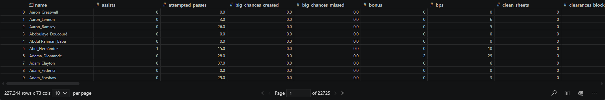
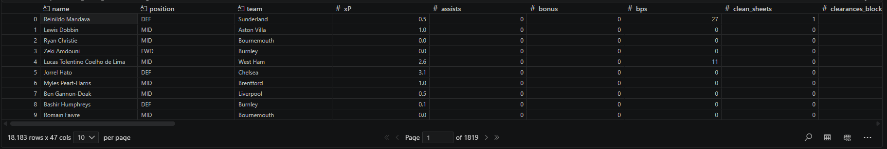
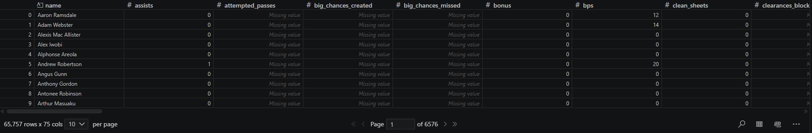
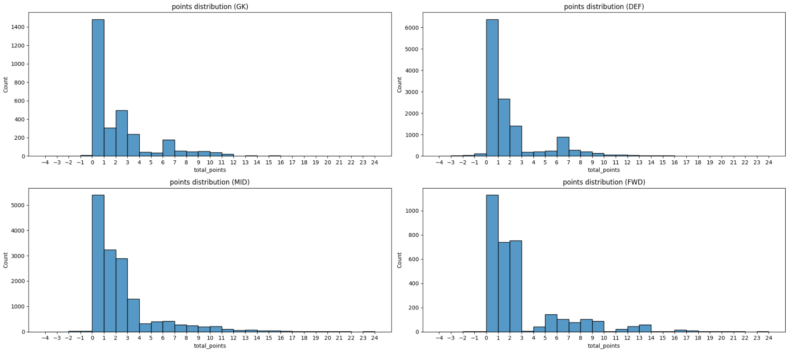

# Forecasting Fantasy Premier League Player Points Using Multiple Linear Regression
## Executive Summary
Fantasy Premier League (FPL) is a game in which users select a squad of Premier League players who earn points based on real match performances. This project aims to help users maximise points by enabling informed decision making through multiple regression models that predict player points using historical performance data. A combination of player, performance and fixture variables were used to estimate points in future gameweeks (GWs).

The dataset was created by combining historical data for current players with current season data, before being cleaned and split into training and testing sets. Model performance was evaluated using $R^2$, RMSE and MAE, the results suggest that linear regression can identify a moderate relationship between historical player performance and FPL points.

While the model performs well for regularly playing player, its accuracy may decrease overtime and for those with limited minutes or matches. Overall, the analysis predicts that Igor Thiago is predicted to achieve the highest number of points and Nordi Mukiele is forecasted to achieve the highest points per million.

## Project background

FPL is an online football game played by over 12.8 million users (Wikipedia, 2026) in which a user selects a squad of fifteen Premier League players (two goalkeepers, five defenders, five midfielders and three forwards) who earn points based on real match performances. Users have a budget of £100,000,000 to build their squad, with a maximum of three players allowed per club, users can transfer players between gameweeks (Fantasy Premier League, no date). Player prices are set before the season starts but change dynamically throughout the season depending on player demand (Editorial, 2026). Players earn points for actions such as minutes played, goals scored, goals assisted and keeping clean sheets however points can be deducted for conceding goals or receiving cards; points earned for actions vary per playing position (The Scout, 2025).  

## ETL Pipeline

  
  <b>Figure 1: ETL Pipeline</b>

## Data preparation and Source
The data was sourced from a GitHub repository (Vaastav, 2026) that contained both current seasons
FPL data and historical data from the previous nine seasons. An advantage of using open data is that
it imporves the reproducibility of the analysis (The University of Manchester, 2025); reproducibility
is important in data science as it builds trust in the model (University of Cambridge, no date). Using
Python, the historical data was extracted, combined into a single DataFrame (Figure 2) and then merged
with the current season data (Figure 3) using an inner join on player name (Figure 4). This ensured that
only players currently active and available for FPL selection were included in the analysis. A disadvantage
of joining on player name is that it could cause ambiguity as names could change between seasons or
multiple players share the same name however player name was chosen because player ID changed each
season. Nonessential columns were removed to limit unnecessary complexity, ensuring that the dataset
is relevant and has an appropriate level of granularity improves the data quality of the dataset (Jones,
no date)

  
  <b>Figure 2: Historical Dataset</b>

  
  <b>Figure 3: Current Season Dataset</b>

  
  <b>Figure 4: Combined Dataset</b>

## Exploratory Data Analysis
The datasets were inspected to ensure the data types were correct; this is important because incorrect datatypes can reduce model accuracy (Wicaksono, 2025). Using the formula below the sample sizes were evaluated to determine whether they were sufficient for analysis (Seabrook, 2025); Table 1 indicates that the samples sizes were sufficient to perform the analysis and reduce the risk of overfitting (Ghasemzadeh et al,2024).

Sample size formula: **N ≥ 10k**

Where:  
- **N** = Required sample size  
- **k** = number of independent variables  

| Position   | Sample Size| Required Sample Size| Conclusion                                                              |
|------------|------------|---------------------|----------------------------------------------------------------------------|
| Goalkeeper | 4311       | 110                 | Sample size ≥ required sample size, therefore it is sufficient             |
| Defender   | 18537      | 100                 | Sample size ≥ required sample size, therefore it is sufficient             |
| Midfielder | 21896      | 110                 | Sample size ≥ required sample size, therefore it is sufficient             |
| Forward    | 4790       | 90                  | Sample size ≥ required sample size, therefore it is sufficient             |

<b>Table 1: Sample sizes</b>

The histograms (Figure 5) show that most players score between 0 and 3 points per gameweek however
the distribution spread increases from goalkeepers to forwards. Forwards display the greatest variability
and highest potential for extreme points; likely due to increased opportunity to perform high-earning
actions such as scoring goals.

  
  <b>Figure 5: Histogram</b>

## Models Iteration 1 (i1)
### Models Variables
The variables in Tables 2-5 were used to create the models using the formulae below:

<b>Table 2: Goalkeeper Variables (click to expand)</b>

 

| Variable | Variable name |
|----------|--------------|
| X_gk1    | previous_5_game_avg_minutes |
| X_gk2    | previous_5_game_avg_saves |
| X_gk3    | previous_5_game_avg_total_points |
| X_gk4    | previous_5_game_avg_influence |
| X_gk5    | previous_5_game_avg_goals_conceded |
| X_gk6    | previous_5_game_avg_clean_sheets |
| X_gk7    | previous_5_game_avg_penalties_saved |
| X_gk8    | previous_5_game_avg_yellow_cards |
| X_gk9    | previous_5_game_avg_red_cards |
| X_gk10   | value |
| X_gk11   | was_home |

<b>Table 2: Goalkeeper Variables</b>

